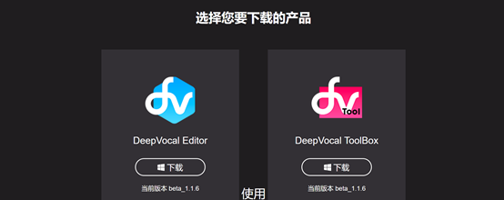

# 调校前的准备

## 安装deepvocal
deepvocal的最新版本为1.1.6，更新日期2019年9月20日

首先访问[deepvocal官网](https://www.deep-vocal.com/#/)，点击"下载"



点击左边的"下载"按钮（右边是做音源用的，我们先不用下载），解压，运行里面的exe文件，一路点下一步就行了。

安装时最好放在非C盘（否则设置可能不能保存），空间充裕的磁盘

## 寻找音源
### 新手上路

新手上路选择音源，最重要的一点是“稳定”。

具体来说，音源的音量要稳定，不能忽大忽小。同一韵母的发音要一致，例如，"yan"，"bian"，"jian"的发音要尽量一致。音源不能有过多的小bug。另外，音质要干净，不能有过大的底噪、振幅过载、喷麦等现象。

一个稳定的音源，可以让你第一次导入工程，灌好词，即可得到一个听得过去的音频，快速上手探索dv的各项功能，而无需进行细节上的debug。

这里推荐北京航空航天大学开发的[飞梦](http://buaaacg.org/2019/06/29/vbrelease/)。

### 国内音源
在b站搜索"[deepvocal 配布](https://search.bilibili.com/all?keyword=deepvocal%20%E9%85%8D%E5%B8%83)"，视频简介或评论区会有音源下载链接，一般是百度网盘或qq群文件。由于dv音源较大，建议加入qq群下载，用手机qq将群文件转发给电脑下载速度更快

[这个专栏](https://www.bilibili.com/read/cv4252529)整理了b站2019年的所有dv音源

### 国外音源
可以在[fandom deepvocal wikia](https://deepvocal.fandom.com/wiki/DeepVocal_Wikia)寻找

部分国外音源使用 google drive 或 onedrive 配布

如果无法访问 google drive：可使用chrome插件[ghelper](https://microsoftedge.microsoft.com/addons/detail/eoboojokdmamahfilfmamjjkcmkmddgk)访问

如果无法访问 onedrive：将分享链接中的"1drv.ms"改为"1drv.ws"

## 安装音源
exe：直接运行，可安装到任意位置，建议安装到空间充裕的磁盘

压缩包（含SKI,SKC,voice.sksd）：解压到deepvocal安装目录下的singers文件夹中，使目录结构如下所示
```
DeepVocal.exe
singers
 └─xxx
    ├─SKI
    ├─SKC
    └─voice.sksd
```
示例


[上一章：Deepvocal简介](./1_description.md)