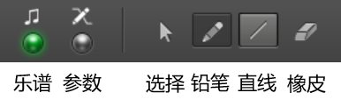
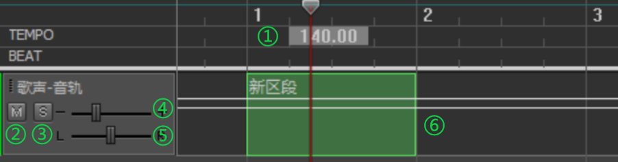
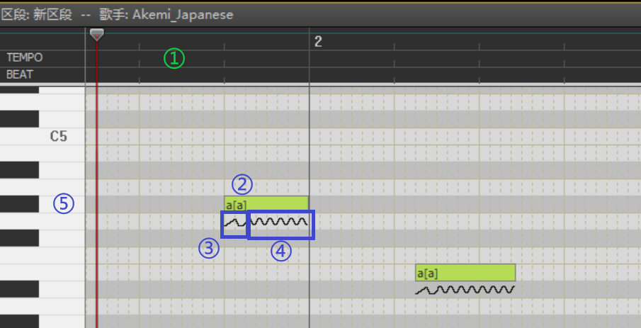
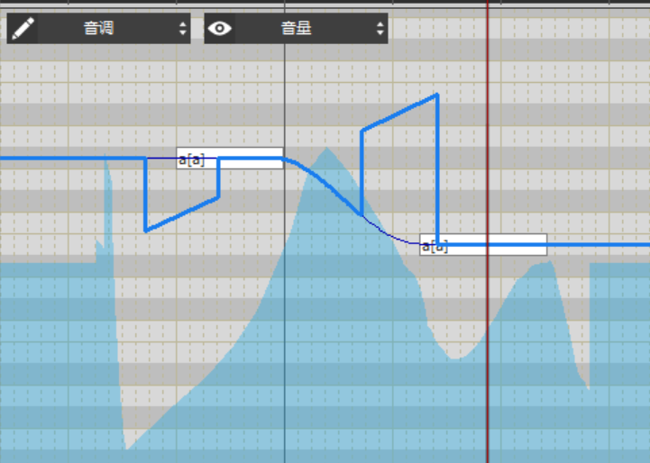

# 软件界面

dv的界面自上而下分为4个区域：菜单栏、工具栏、音轨窗、钢琴窗。其中，音轨窗、钢琴窗中间的分隔线可以上下拖动，调整大小。

## 工具栏
从左至右依次是播放控制、播放状态、编辑模式、编辑工具

### 播放控制
这个区域其实一般用不到，用键盘空格键就可以播放、停止

### 播放状态

曲速和节拍在这里改不了，修改方式：音轨窗拖到最左边，双击“TEMPO”后面的数字

### 编辑模式、工具

## 音轨窗

包括合成音轨（绿色）和伴奏（红色）

①：曲速区，双击空白位置可以中途改变曲速。曲速标记可以左右拖动，用橡皮删除

②：音轨静音

③：音轨独奏（其他音轨全部静音）

④：音量

⑤：左右声道平衡

⑥：区段编辑区，可以用铅笔画区段，或者用橡皮删除区段

## 钢琴窗（乐谱模式）

①：曲速区，同上

②：音符，双击音符输入歌词，支持汉字和拼音，可连续输入（一次输入多个汉字或用空格分隔的拼音，会自动分配给后续音符）

③：滑音编辑

④：颤音编辑

⑤：钢琴键盘，鼠标点击播放音高提示

## 钢琴窗（参数模式）

参数模式下，音符会变成白色作为背景，在其上覆盖显示参数。可以同时显示两个参数。其中，前景参数（铅笔符号）可以编辑。背景参数（眼睛符号）只能查看

按Ctrl+E在乐谱模式与参数模式间切换

按Ctrl+Tab交换前景参数和背景参数

目前（1.1.6）dv支持6个参数：音量，音调，气声，音素，音色，声线（性别）

[上一章：调校前的准备](https://gitee.com/oxygendioxide/dvdoc/blob/master/deepvocal/2_preparation.md)