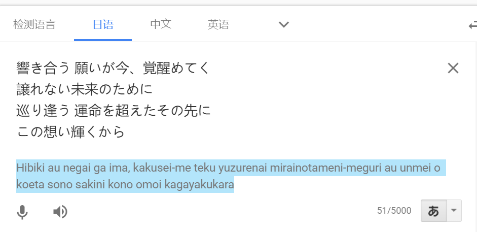
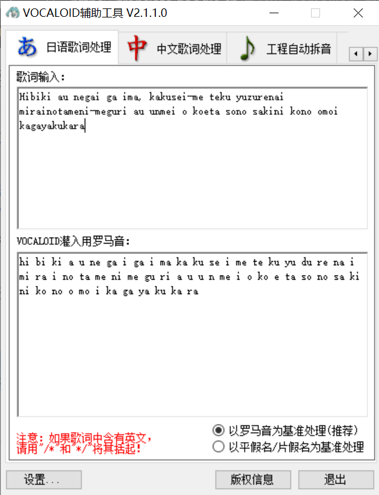

# 调校流程

## 工程获取
扒谱是一个很辛苦，且可能有难度的工作。因此我们一般在网上寻找想要的工程。

**如果使用别人的工程投稿，请注明工程来源**

我一般按照"sk=dv>vsqx>ust>midi"的优先级寻找

以下是寻找工程的一些方式

- 专门的工程分享网站：[vsqx.top](vsqx.top) [midishow](https://www.midishow.com/)
- 在b站或搜索引擎搜索 "歌名 vsqx" "歌名 ust" "歌名 midi"
- 工程配布站：一般在lofter上面，可以关注他们

找到工程后，如果是vsqx, mid, sk, dv，直接用deepvocal打开即可。如果是ust，先用utau打开，导出midi，再用dv打开。

## 灌词
如果是mid文件，或者自己扒的谱，导入dv之后是没有歌词的，需要自行灌词

歌词的获取有以下几种方式

- 音乐网站（用网页版，可以复制歌词）
- b站评论区
- 搜索引擎（可以找到一些日文歌曲的罗马音歌词）
- b站字幕下载，参考[这个专栏](https://www.bilibili.com/read/cv2223816/)

日文歌词，用[Google翻译](https://translate.google.cn/)转罗马音

然后用vocaloid辅助工具切分

这样转出来可能会存在很多错误，灌入dv后记得检查，修正。
