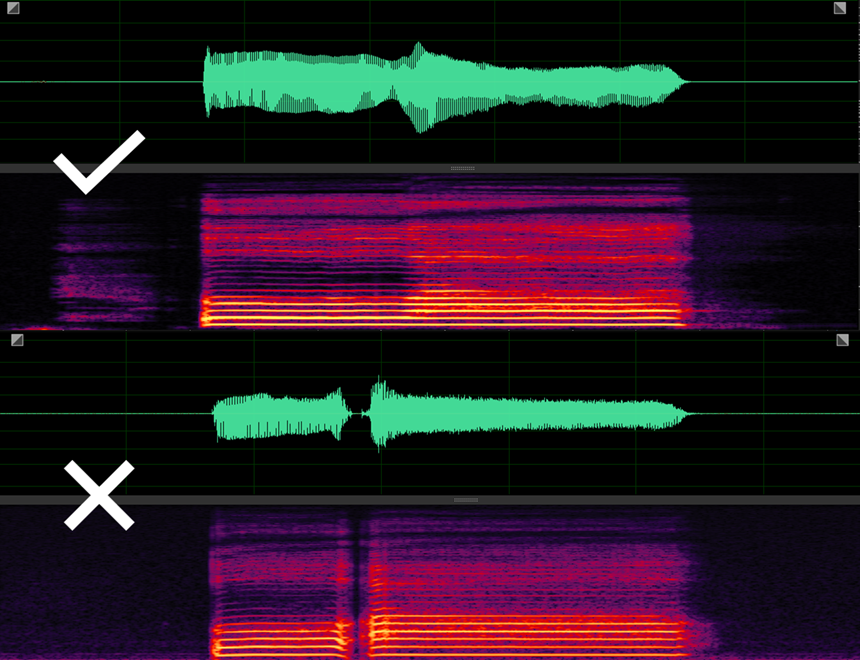

# 录音

本教程中使用Oremo录音，它具有以下功能：
1. 加载录音表，自动将录制的音频命名并保存在同一文件夹下
2. 在录音时播放bgm，帮助声优更好地把握音高和时值

使用Oremo录音，可以大大降低后期处理和原音设定的工作量。

Oremo软件下载：[官网](https://osdn.jp/users/nwp8861/pf/OREMO/wiki/FrontPage)  [简体中文版](http://tieba.baidu.com/p/6059601688) 

Oremo的使用方法参照[Haru UTAU音源录音教程](https://utaujc.jimdofree.com/blog/utau%E9%9F%B3%E6%BA%90%E5%BD%95%E9%9F%B3%E6%95%99%E7%A8%8B-1/)

对于dv音源来说，还需注意以下几点：
1. 元音与元音要连接，不要断开。

## 参考链接
[Haru UTAU音源录音教程（文字教程）](https://utaujc.jimdofree.com/blog/utau%E9%9F%B3%E6%BA%90%E5%BD%95%E9%9F%B3%E6%95%99%E7%A8%8B-1/)

[昼_Hiru UTAU音源制作教程集（视频教程）](https://www.bilibili.com/video/av45267043/)

[星鼻鼹鼠 【UTAU教程】中文CVVC音源教程（视频教程）](https://www.bilibili.com/video/av2632381/)