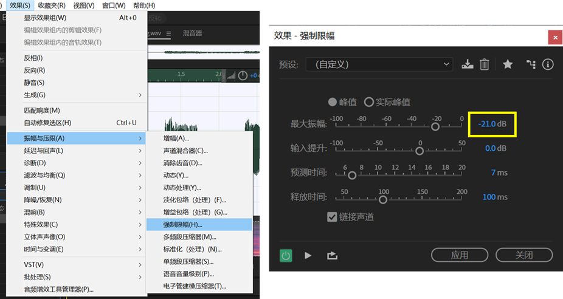

# 音频后期处理
这一章以Adobe Audition(au)为例，介绍dv音源后期处理方法。

在处理前，请备份原始音频。

多音阶音源，每个音阶要分别后期处理。

## au批处理的准备工作
au批处理可以对多个音频文件批量实施操作，如降噪、压限等。要使用批处理，需要事先进行以下两个步骤：

### 启用批处理功能
首先打开au，窗口->勾选“批处理”，调出批处理面板。

点击批处理面板中的"导出设置"，勾选“与源文件位置相同”，“覆盖现有文件”，取消勾选“包含标记和其他元数据”，点击“确定”

### 收藏操作
au要先收藏操作才能在批处理中调用。下面以“降噪”为例，介绍添加收藏夹的方法。

打开一个音频文件，选中文件结尾的纯噪音区域，点击“效果->降噪/恢复->捕捉噪音样本”。

依次点击
    
    “收藏夹->开始记录收藏”
    
    “效果->降噪/恢复->降噪（处理）”
    
    “应用”

    “收藏夹->停止记录收藏”

然后保存为“降噪”。

以后就可以在批处理面板“收藏”一栏中找到“降噪”并调用了。

## 降噪
从文件管理器将音频文件全部拖入批处理面板。

任选一个音频文件，选中文件结尾的纯噪音区域，点击“效果->降噪/恢复->捕捉噪音样本”，然后取消选中区域。

在批处理面板上，“收藏”一栏选择“降噪”，点击“运行”。

## 音量统一
dv音源如果不进行音量统一，在合成时音量会忽大忽小，尤其是在不同音阶过渡时。这会严重影响音量参数的使用体验。因此，建议将音量统一到-9dB

首先，比较音源中不同韵母的音量，选择较小的韵母作为音量统一基准。这里，我们发现ri音量较小，约为-21dB

将“效果->振幅与压限->强制限幅->最大振幅-21.0dB”加入收藏夹，命名为“限幅-21dB”

在批处理面板选择“限幅-21dB”，点击“运行”。

现在所有音频的音量为-21dB。接下来把音量增大到-9dB

将“效果->振幅与压限->标准化（处理）->标准化为-9dB”加入收藏夹，命名为“标准化为-9dB”

在批处理面板选择“标准化为-9dB”，点击“运行”。