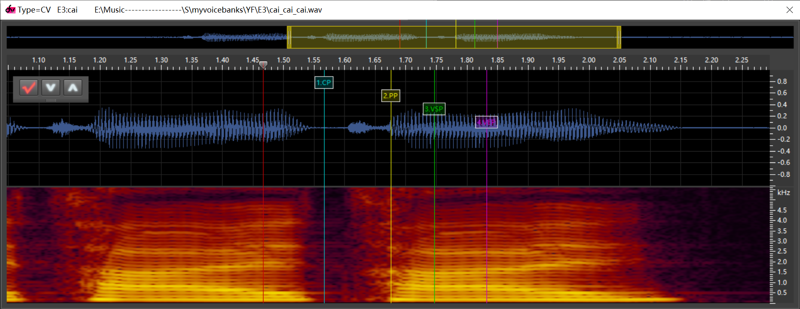
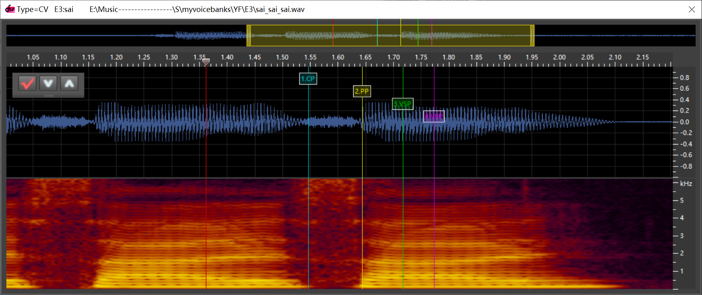
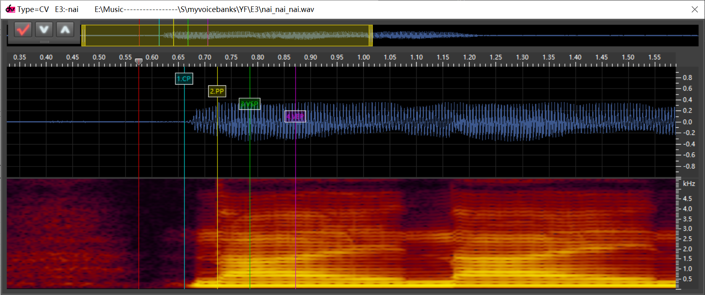
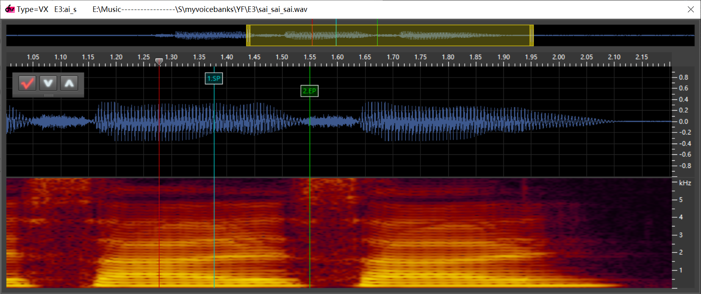
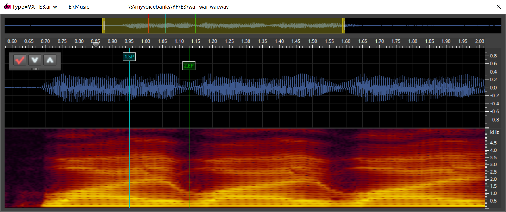
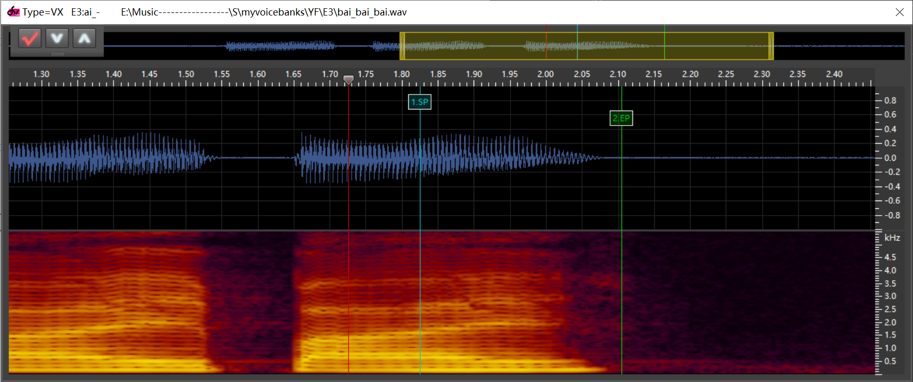
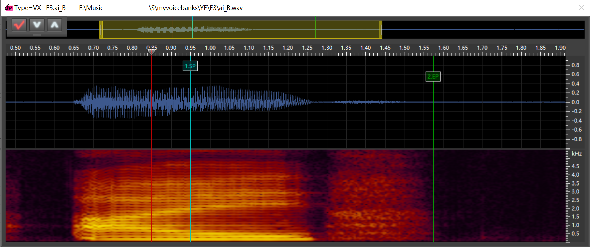
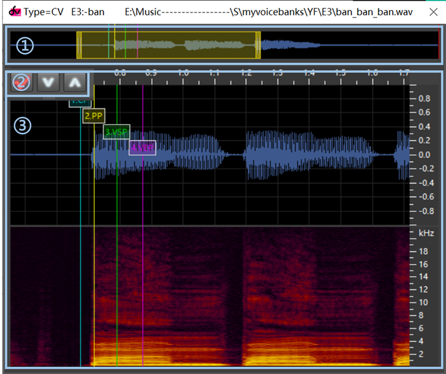

# 原音设定
dv原音设定，就是告诉dv，你的音频哪一段是元音，哪一段是辅音。

## 原理
先从dv的“音素”参数说起

在dv中，音节分为4个部分：
> 声母：红色段，在音符开始前即发声，占用上一个音符的时值。
> 
> 韵头：黄色段，声母向稳定韵母过渡的部分（介母）
> 
> 韵腹：绿色段，稳定韵母，随着音符拉长而拉长
> 
> 韵尾：紫色段，稳定韵母向结尾过渡的部分

其中，声母、韵头、韵腹这三部分来自完整音节（如zha，下称CV段），而韵尾来自音节到下一个音节或尾音的过渡（如a_zh,a_-,a_R，下称VX段）。

### CV段
1线：
- 塞音、塞擦音（与上一个音节之间有不发音间隙）：不发音间隙的正中间
- 擦音：辅音刚开始的地方，略微偏右
- 浊辅音：辅音的正中间
- 开头音（无论发音类型）：发音开始前没有声音的地方

2线：辅音和元音交界处

3线：稳定元音开始处（听不到介母的地方）

4线：稳定元音结尾处（音量尚未减小的地方）

  
<mark>点击查看示例</mark>

  塞音、塞擦音(cai)
  
  擦音(sai)
  
  浊辅音(wai)
  
  开头音(-nai)
  

### VC段
1线：稳定元音结尾处（音量尚未减小的地方）

2线：
- 塞音、塞擦音（与上一个音节之间有不发音间隙）：不发音间隙的正中间
- 擦音：辅音刚开始的地方，略微偏右
- 浊辅音：辅音的正中间
- 尾音：发音结束后没有声音的地方

  
<mark>点击查看示例</mark>

  塞音、塞擦音(ai_c)
  
  擦音(ai_s)
  
  浊辅音(ai_w)
  
  自然尾音(ai_-)
  
  语尾息(ai_B)
  

## dvtb原音设定操作
打开dvtb，Function->Build Voice Config，进入原音设定列表。在该界面可以对原音设定进行添加、编辑、重命名、删除等操作

首先，点击“Wav Location”，选择wav文件所处的文件夹

编辑原音设定：选中一条原音设定，点击“Edit markers”，进入原音设定编辑界面

该界面由以下三部分组成：

1.波形全景图。黄色部分是当前波形与频谱显示部分，黄色部分及其两端均可拖动。用鼠标滚轮可扩大/减小黄色部分范围。

2.导航栏。从左至右依次是保存，下一条，上一条。

3.波形与频谱窗。
    鼠标滚轮可扩大/减小显示区域大小。右边标尺上鼠标滚轮可纵向伸缩。顶部标尺鼠标拖动可左右移动显示区域范围

该界面的快捷键包括：
- 数字键1/2/3/4：将1线/2线/3线/4线移动到当前播放指针所处位置

- 空格：开始播放/停止播放

- 回车：保存

- ↑：上一条

- ↓：下一条

- Tab：保存并进入下一条

## 使用dvcfg模板生成器

## 参考链接
[Boxstar dvtb教程](https://share.weiyun.com/5snXMol)

