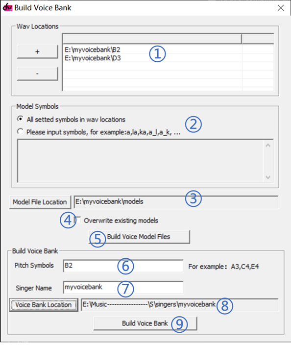

# 编译与打包
现在，所有辛苦的工作都已经完成，离在dv上使用只差最后一步：编译与打包。

dvtb将音频和原音设定编译为后缀名为DVModel的中间文件，再打包为dv音源（包含SKC、SKI、voice.sksd三个文件）。这类似于java源文件编译为class文件，再打包为jar包。

## 编译
打开dvtb，Function->Build Voice Bank，进入编译与打包窗口

1. 在“wav location”中，把音源中所有的音频文件夹添加进来。
2. 在Model symbol中，选择编译全部发音（第一项），或者编译指定发音（第二项）并在下面的文本框中输入你需要编译的发音。
3. 点击“Model File Location”，选择你存放DVModel文件的文件夹
4. 如果需要覆盖已有的DVModel文件，则选中“Overwrite existing models”
5. 点击“Build Voice Model File”，选择日志文件的存放位置，开始编译。

编译所需时间因电脑配置而异，中文CVVC每个音阶大约半小时。

编译过程中，错误的原音设定和过低的音质会导致报错。遇到报错时，首先应检查原音设定是否有错误，再按照下表排查。以下是报错信息的含义：

|报错信息|含义|可能原因与解决方案|
|-|-|-|
|File create failed | 文件建立失败 | 文件被占用或无权限，请将DVModel文件的存放位置设置在非系统盘 |
|Markers sequence error | 标记顺序错误 | 一般是生成dvcfg文件的第三方软件的bug |
|Unvoiced part exists in voiced consonant | 浊辅音中出现了清音| 请尝试将出现问题的辅音移到清辅音列表中，并重新编译 |
|Unvoiced part exists in vowel | 元音中出现了清音 | 音频有杂音，请用相同拼音替换或重录 |
|Unvoiced part exists in the start of this continuant | 连接音的起始点是清音 | 音频有杂音，请用相同拼音替换或重录 |
|Symbol error | 符号错误，不符合规范 | |
|Pitch symbol error | 音高符号错误 | |
|Unvoiced part exists in continuant to vowel | V_V中出现了清音| 元音连接处要连续，不要断开 |
|Unvoiced part exists in continuant to voiced consonant | V_C(浊辅音)中出现了清音| 请尝试将出现问题的辅音移到清辅音列表中，并重新编译 |

## 打包
还是在编译与打包窗口

6. 在Pitch Symbol中输入你所有需要打包的音阶
7. 在Singer Name中输入音源名称
8. 选择导出音源的文件夹
9. 点击“Build Voice Bank”，选择日志文件的存放位置，开始打包

打包所需时间一般在1分钟内，会在输出文件夹下生成SKC、SKI、voice.sksd三个文件。打包完成后会显示缺失的DVModel中间文件。