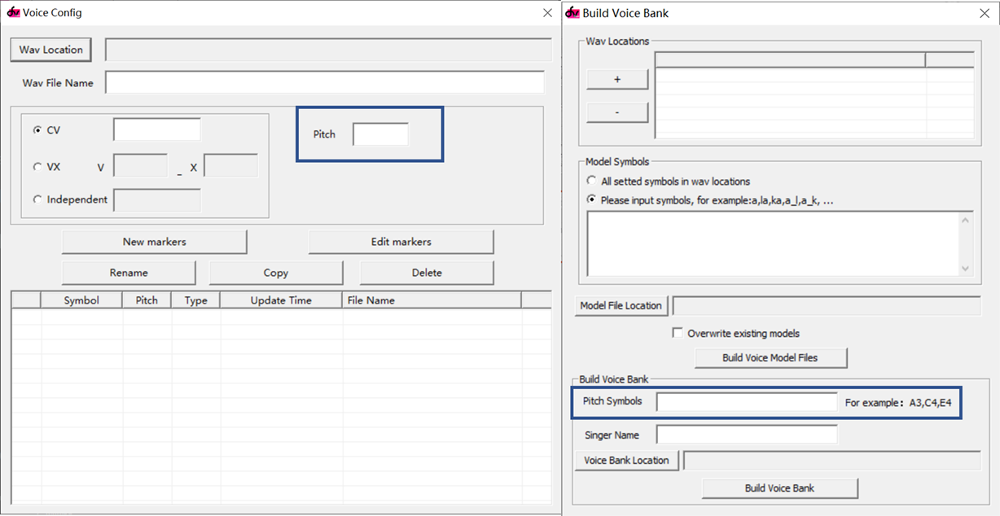

# 多音阶音源的具体机制
dvtb中涉及一个概念：采样音阶。它在原音设定和打包时都要填写。

下面就来分析一下采样音阶的具体机制

一个多音阶的音源，每个音阶单独拿出来看，都是一个完整的单音阶音源。之所以要做多音阶音源，是因为变调引擎在变调跨度很大的时候会失真。为了覆盖更为广阔的音域，需要在多个音高上录制声音。合成引擎根据音符的目标音高自动选择距离最近的音阶来合成。

这里填写的“采样音阶”仅仅是一个标签，它不会影响dv引擎的编译与合成，仅仅用于采样音阶与目标音高间的映射。

所以，对于单音阶音源，采样音阶可任意填写，不会影响合成结果（但还是建议填写真实音高，因为以后可能会增加新的音阶）

## 一些建议
1. 录制多音阶音源时，每4~5个半音录一个音阶。更密的音阶并不能显著提高音源合成质量，还会增加工作量，增大音源体积，提高调试难度（音源中的bug难以通过测试曲被发现），降低稳定性。

2. 如果录制了假声音阶想隐藏，可以填写为很高的音（如C8）。