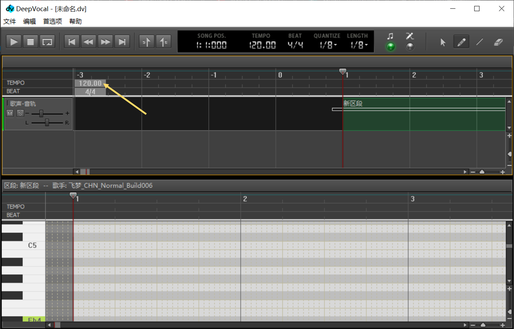
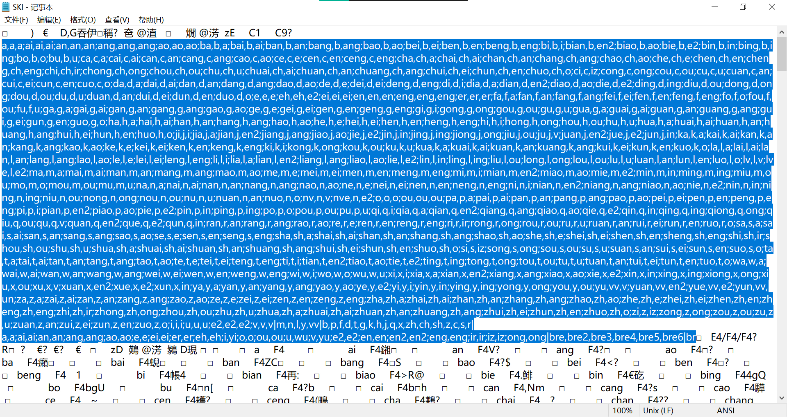
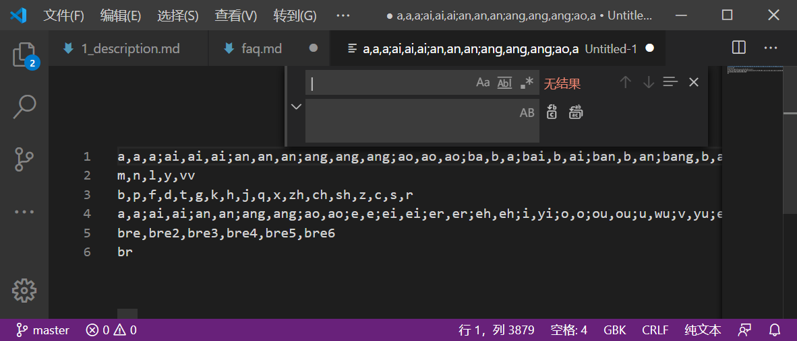
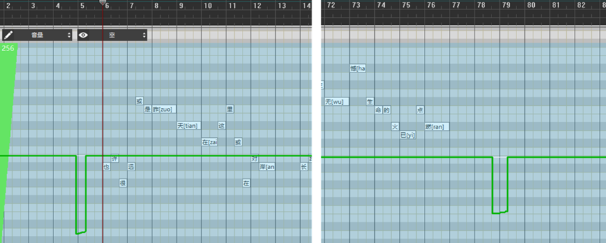
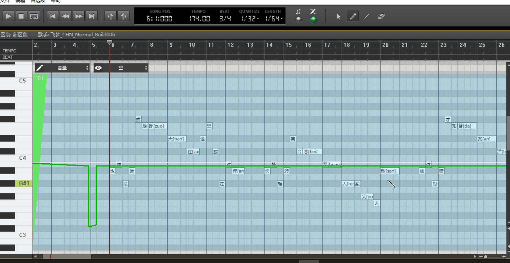

# Deepvocal常见问题(FAQ)
按ctrl+F可以在本文中查找

## 1.如何导入音源？
exe：双击运行，按提示一步步操作即可（安装位置随意，建议安装到空间充裕的磁盘）

压缩包：解压到deepvocal安装目录下的singers文件夹中，使目录结构如下所示
```
singers
 └─xxx
    ├─SKI
    ├─SKC
    └─voice.sksd
```

## 2.如何修改曲速？（BPM）
音轨窗拖到最左边，双击左上角“TEMPO”后面的数字


## 3.dv编辑器闪退怎么办？
dv编辑器具有自动备份功能，默认为每5分钟保存一次。

如果是新建文件，或新导入的mid、vsqx文件，那么文件丢失，只能重新开始编辑

如果已经保存了dv文件，则同一文件夹下会出现后缀名为.dv_bak的文件，它就是自动备份文件，用deepvocal打开即可。

## 4.每次导出音频就闪退，怎么办？
删除所有伴奏音轨，再尝试导出

## 5.设置保存不了/每次打开都是默认幻晓伊，改不了，然而我并没有安装这个音源
临时解决方案：用管理员身份运行dv

永久解决方案：卸载dv，然后安装到C盘外的其他磁盘

## 6.UTAU ust文件如何导入dv?
UTAU导出的midi导入dv自带歌词，参数尚不支持 

## 7.如何查看音源的发音列表与特殊功能？
用记事本打开SKI文件，可以看到前后都是乱码，我们只需要看中间部分

为方便浏览，复制粘贴到vscode中,将|替换为回车

第1行：音节

第2行：浊辅音

第3行：清辅音

第4行：元音

第5行：呼吸音

第6行：尾音

## 8.如何修改全局参数（音量、气声、声线）
首先在音轨两端没有音符的地方分别画一笔


然后按键盘上下键


